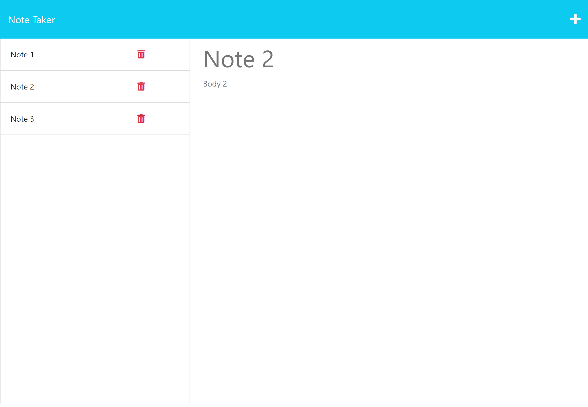

# Note Maker / Module 11

## Description

This web application has a simple interface for taking notes and saving them to a database to be viewed later. Notes can also be deleted once they are no longer needed.

## Usage

To use the application, navigate to https://glacial-lake-88025.herokuapp.com/. Click "Get Started", and you will be taken to the main view of the application with saved notes on the left and note input on the right. To add a note, enter both title and body information, at which point you'll see a save icon appear in the top right of the app. Clicking it will alert you that the note has been saved, and you'll then see your saved note appear in the left sidebar.

If you want to enter another note, you can click the '+' icon in the top right and repeat the process. If you want to go back and view notes at any time, you can click on that note in the sidebar, and it's title and body will re-appear on the right side of the page in read only mode. These notes will persist in the database should you want to come back to them at a later date. And if you want to delete a note, clicking the red trash icon on the corresponding note will remove it from the database.

## Screenshot

## License

Please refer to the LICENSE in the repo.

## Credits

* MIT License generated by GitHub